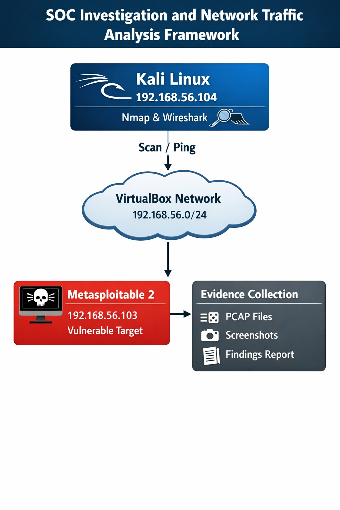

# SOC Investigation Lab

## Project Overview

This project demonstrates a Security Operations Center (SOC) investigation workflow using Kali Linux, Metasploitable 2, Nmap, Wireshark, and VirtualBox.

The objective is to simulate a real-world SOC analyst environment by performing network discovery, traffic analysis, evidence collection, and vulnerability assessment in a controlled lab environment.

---

## Lab Architecture

<p align="center">
  
</p>

### Environment Overview

| Component | IP Address | Purpose |
|------------|------------|------------|
| Kali Linux | 192.168.56.104 | Analyst Machine |
| Metasploitable 2 | 192.168.56.103 | Vulnerable Target |
| VirtualBox Host-Only Network | 192.168.56.0/24 | Isolated Lab Network |

---

## Tools Used

- Kali Linux
- VirtualBox
- Metasploitable 2
- Nmap
- Wireshark

---

## Network Verification

The first phase of the investigation was to verify connectivity between the analyst machine and the target system.

### Ping Test

Command:

```bash
ping 192.168.56.103
