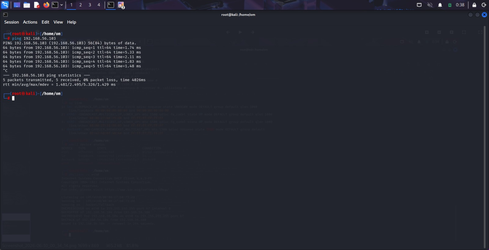
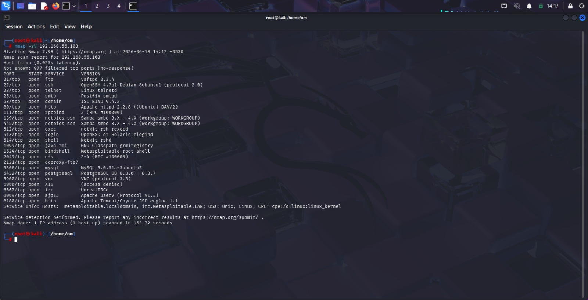
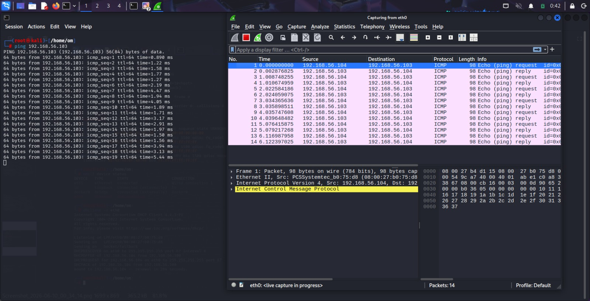

# Final SOC Investigation Findings

## Executive Summary

This Security Operations Center (SOC) investigation was conducted in a controlled VirtualBox laboratory environment using Kali Linux as the analyst workstation and Metasploitable2 as the target system.

The objective of the investigation was to verify network connectivity, enumerate active services, capture network traffic, collect digital evidence, and perform a security assessment. The investigation successfully identified multiple exposed services and demonstrated a complete SOC investigation workflow using industry-standard cybersecurity tools.

---

## Host Information

| System | IP Address |
|----------|------------|
| Kali Linux (Analyst Machine) | 192.168.56.104 |
| Metasploitable2 (Target Machine) | 192.168.56.103 |

---

## Investigation Summary

### Activities Performed

- Network Verification
- Service Enumeration
- Traffic Capture and Analysis
- Evidence Collection
- Security Assessment
- Documentation and Reporting

---

## Network Verification

### Objective

Verify connectivity between the analyst machine and target machine.

### Result

- Successful ICMP communication established.
- No packet loss observed.
- Target host responded correctly to ping requests.

### Evidence



---

## Service Enumeration

### Objective

Identify active services running on the target system.

### Command Used

```bash
sudo nmap -sV 192.168.56.103
```

### Discovered Services

| Port | Service | Risk Level |
|------|----------|------------|
| 21 | FTP | Medium |
| 22 | SSH | Low |
| 23 | Telnet | High |
| 25 | SMTP | Medium |
| 53 | DNS | Low |
| 80 | HTTP | Medium |
| 139 | NetBIOS | High |
| 445 | SMB | High |
| 3306 | MySQL | Medium |
| 5432 | PostgreSQL | Medium |
| 5900 | VNC | Medium |
| 6667 | IRC | Medium |

### Evidence



---

## Traffic Analysis

### Objective

Capture and analyze network traffic generated during reconnaissance and connectivity testing.

### Tool Used

Wireshark

### Observed Traffic

- ICMP Echo Requests and Replies
- TCP Connection Attempts
- SMB Communication
- NetBIOS Traffic
- Service Discovery Activity

### Evidence



---

## Security Assessment

### High-Risk Findings

- Telnet service enabled on Port 23
- SMB service exposed on Port 445
- NetBIOS service exposed on Port 139

### Medium-Risk Findings

- FTP service accessible on Port 21
- HTTP service accessible on Port 80
- Database services exposed (MySQL and PostgreSQL)
- VNC remote access service detected

### Low-Risk Findings

- SSH service available for secure administration
- DNS service operational

---

## Potential Security Impact

If deployed in a production environment, these exposed services could increase the attack surface and potentially allow:

- Unauthorized Access
- Credential Theft
- Information Disclosure
- Lateral Movement
- Service Exploitation

---

## Evidence Collected

### Packet Capture

```text
pcaps/network_capture.pcapng
```

### Screenshots

- Ping Verification
- Nmap Service Enumeration
- Wireshark Traffic Analysis
- SOC Architecture Diagram

---

## Recommendations

1. Disable unnecessary services.
2. Replace Telnet with SSH.
3. Restrict SMB and NetBIOS access.
4. Apply system security updates.
5. Implement firewall restrictions.
6. Conduct regular vulnerability assessments.
7. Monitor network activity continuously.
8. Perform periodic security audits.

---

## Conclusion

The investigation successfully demonstrated a complete Security Operations Center (SOC) workflow in a controlled laboratory environment.

The assessment confirmed successful connectivity between systems, identified multiple exposed services, captured and analyzed network traffic, and documented security findings. The project provided practical experience in network reconnaissance, packet analysis, evidence collection, risk assessment, and incident documentation using Kali Linux, Nmap, and Wireshark.

---
## Key Findings Summary

✅ Network connectivity successfully verified

✅ 12 active services identified on the target system

✅ High-risk services detected:
- Telnet (Port 23)
- SMB (Port 445)
- NetBIOS (Port 139)

✅ Network traffic captured and analyzed using Wireshark

✅ Evidence preserved through screenshots and packet capture files

✅ Security risks assessed and documented

✅ Recommendations provided for remediation and hardening

---
## Analyst Information

**Analyst:** Om Sone

**Project:** SOC Investigation Lab

**Tools Used:**

- Kali Linux
- Nmap
- Wireshark
- VirtualBox
- Metasploitable2

---

## Disclaimer

This project was conducted in an isolated laboratory environment using intentionally vulnerable systems for educational and research purposes only.
